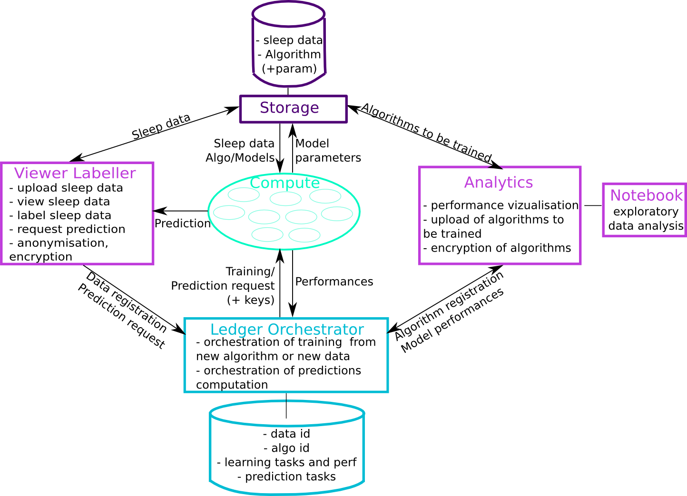

# Introduction to Morpheo 

## Main concepts

## Morpheo Architecture

Morpheo architecture is organized as below:

### Viewer

Entry door for data providers. This is part of the data client described in the white-paper.  

Detailed documentation here (TODO).  

### Analytics and Notebook 

Entry door for algorithms providers. This is part of the data client described in the white-paper.  

Detailed documentation:
- here for Analytics (TODO) 
- here for Notebook (TODO).  

### Storage 

Wharehouse of encrypted data and algorithms. 

Detailed documentation [here](https://github.com/MorpheoOrg/storage).

### Compute

Secured containers performing learning and prediction tasks.  

Detailed documentation [here](https://github.com/MorpheoOrg/compute).  

### Orchestrator 

Orchestrator of operations on the platform. 

Detailed documentation [here](https://morpheoorg.github.io/morpheo-orchestrator).
