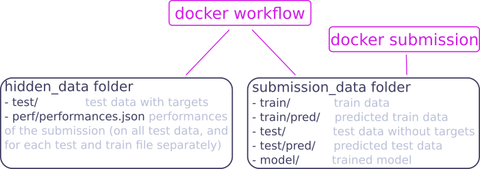

# Machine learning mechanisms on Morpheo

## Definition of a machine learning problem on Morpheo

The Morpheo platform can handle different machine learning problems. 
Problems are defined by members of the platform administration.  
The first problem addressed by the platform is sleep stages classification, other potential problems are sleep apnea detection, insomnia detection. 
The definition of a problem requires the creation of a `problem workflow` and a set of data with corresponding targets.  
A `problem workflow` mainly defines what are the **data targets** and the **performance metric** used to evaluate machine learning models.
A new `problem` must be registered in the `Orchestrator` by specifying the UUID of the `problem workflow` and other parameters, such as UUIDs of test data (see in [the Orchestrator documentation for more details on Problem](https://morpheoorg.github.io/morpheo-orchestrator/modules/collections.html#collection-problem)). 

### <a name="problem_workflow"></a> Creation of a problem workflow

The problem workflow is defined by organizers of a problem. 
It mainly defines what are the data targets and the performance metric used to evaluate machine learning models. More precisely, it must do two tasks:
1. remove target from test files to be given to users  
2. compute performances of an algorithm 

For both tasks, the architecture of files and the training workflow [described below](#training_phases) are assumed.
A problem workflow consists of a `Dockerfile` and scripts which do the two tasks below, with the following requirements (assuming the docker image has been built with: `docker build -t docker-workflow .`):
1. To run the image to copy test files from `hidden_data` directory to `submission_data` directory and remove target from them, assuming test files name is `test/test_uuid` (remark that `.hdf5` extension has been omitted for simplicity):
```
docker run -v path_hidden_data:/hidden_data -v path_submission_data:/submission_data docker-workflow -T detarget -i /hidden_data -s /submission_data
```
2. To run the image to compute performances given true data `hidden_data/test/test_uuid` (and `submission_data/train/train_uuid`) and  predicted data `submission_data/test/pred/pred_test_uuid` (and `submission_data/train/pred/pred_train_uuid`):
```
docker run -v path_hidden_data:/hidden_data -v path_submission_data:/submission_data docker-workflow -T perf -i /hidden_data -s /submission_data
```
This must create a json file in `hidden_data/perf` directory containing performances for each file (with keys `test_uuid` and `train_uuid`) and for all test and train files (with keys `test` and `train`).


## Training on Morpheo 

### Definition of Training tasks 

For a given problem, different algorithms can be submitted. 
The submission is made through `Analytics` and managed by the `Orchestrator`, which registers the new algorithm and creates associated training tasks. 
We call an `algorithm` a problem solution that has not been trained, and a `model` when this algorithm has been trained.   
**Training tasks are created in two cases**:  
- when an algorithm is submitted.  
- when new data are submitted, models are updated.   
It implies that **only algorithms supporting online learning** can be submitted to the platform.   

 
Training tasks are specified by the `Orchestrator` with the definition of a `learnuplet` (see in [the Orchestrator documentation for more details on Learnuplet](https://morpheoorg.github.io/morpheo-orchestrator/modules/collections.html#collection-learnuplet)), and are consumed by `Compute`.
`Compute` does the training based on the `problem workflow`, saves the resulting `model` in `Storage` after encryption, and sends the performances to the `Orchestrator`.  

Performances are computed on a **test dataset, fixed for a given problem and not accessible**.  
For now, no cross-validation is done and the **performance is public** (no public and private leaderboard). 
This choice is motivated by the fact that the platform is data-oriented: each time new data is uploaded, models are updated, which limit overfitting possibilities. 
This might change latter if needed.

Performances are also computed on each train data and send by `Compute` to the `Orchestrator` as feedback on the training for `Analytics`. 

#### Training hypothesis summary

- model training at algorithm submission and at new data upload 
- submission of algortihms supporting online learning only  
- no cross-validation  
- model performance transparency (no public and private leaderboard)  

### Algorithm submission

An algorithm is submitted to the platform via `Analytics`, which stores it to `Storage` and registers it to `Orchestrator` (see in the [Orchestrator documentation for details about algorithm registration](https://morpheoorg.github.io/morpheo-orchestrator/modules/collections.html#collection-algo)).   
Algorithms submitted to the platform must support **online learning**, since models are updated each time new data are uploaded.  
This is the case for all **neural networks**.  
Algorithms implemented in the package `scikit learn` can be used if they offer a `partial_fit` method (or a `warm_start` option, TODO: check...).

A submission corresponds to the submission of a [Docker](https://docs.docker.com/engine/getstarted/). It must contain the following elements:  
- a `Dockerfile`  
- script files 

It assumes the architecture of files and training workflow described [below](#training_phases).

Requirements for a submission are the following (the image being built with `docker build -t docker-submission .`):
- To run the image to train or update the model with data in `path` (train data in `path/train/` and called `train_uuid` and test data in `path/test` and called `test_uuid`, remark that `.hdf5` extension has been removed for simplicity):
  ```
  docker run -v path:/data docker-submission -V /data -T train
  ```
  It must:
  - save the model to that next call to this model will use the trained model.
  - create predictions for data in `path/test/test_uuid` files and `path/train/train_uuid` files and save them in `path/test/pred/pred_test_uuid` files and `path/train/pred/pred_train_uuid` files.
- To run the image to make predictions for data in `path/test/test_uuid` files:
  ```
  docker run -v path:/data docker-submission -V /data -T predict
  ```
  It must save the predictions in `path/test_pred/pred_test_uuid` files.


An example of a submission is given for sleep stages classification [here](https://github.com/MorpheoOrg/hypnogram-wf).

##### Note about saving trained models:  
Saving format is let free for now, since it is part of the code submitted for an algorithm.
- for neural networks, best solution is to save them in h5 files
- for sklearn models, avoid using [Pickle](http://scikit-learn.org/stable/modules/model_persistence.html), since it has "some issues regarding maintainability and security". Better to use json (be careful with numpy array and sklearn objects).

### <a name="training_phases"></a> Training phase 

The workflow of the training phase is the following:


This workflow assumes the following files architecture <a name="folders"></a>:




## Predictions on Morpheo 

A user can request a prediction on the platform using the `Viewer`, which transfers the request to the `Orchestrator`. 
To see how to request a prediction to the Orchestrator, see the [Orchestrator documentation](https://morpheoorg.github.io/morpheo-orchestrator/modules/collections.html#collection-preduplet)
